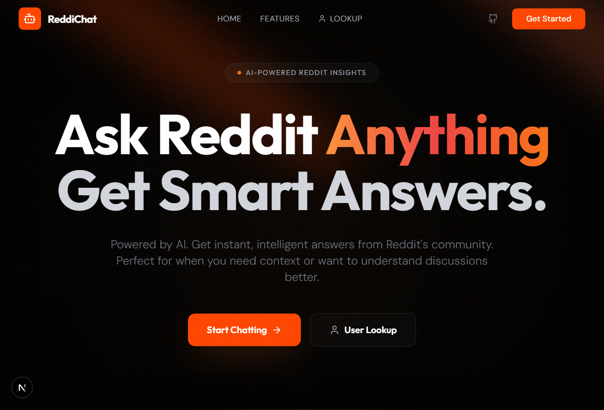

# ReddiChat

> Ask Reddit anything. Get smart, AI-powered answers.

**[Try it live](https://reddichat.manishsingh.tech/)**



## What is ReddiChat?

ReddiChat is an AI chatbot that pulls real-time insights from Reddit to answer your questions. Instead of scrolling through endless threads, just ask — and get answers backed by actual Reddit discussions.

## Features

- **AI Chat with Reddit Context** — Ask anything and get responses enriched with real Reddit discussions, opinions, and trends
- **Source Attribution** — See exactly which Reddit posts informed the answer, with links and metadata
- **Reddit User Lookup** — Look up any Reddit user's profile, posts, comments, and media
- **Persistent History** — Your conversations are saved and searchable across sessions
- **Google & GitHub Login** — Sign in with one click, no account creation needed

## Tech Stack

Next.js 15 / React 19 / Tailwind CSS / Better Auth / Drizzle ORM / PostgreSQL / Gemini 2.5 Flash

## Self-Hosting

```bash
git clone https://github.com/Msparihar/ReddiChat.git
cd ReddiChat/frontend
cp .env.example .env   # fill in your credentials
bun install
bun dev
```

Or with Docker:

```bash
cd frontend
docker build -t reddichat .
docker run -p 3000:3000 --env-file .env reddichat
```

## License

MIT
